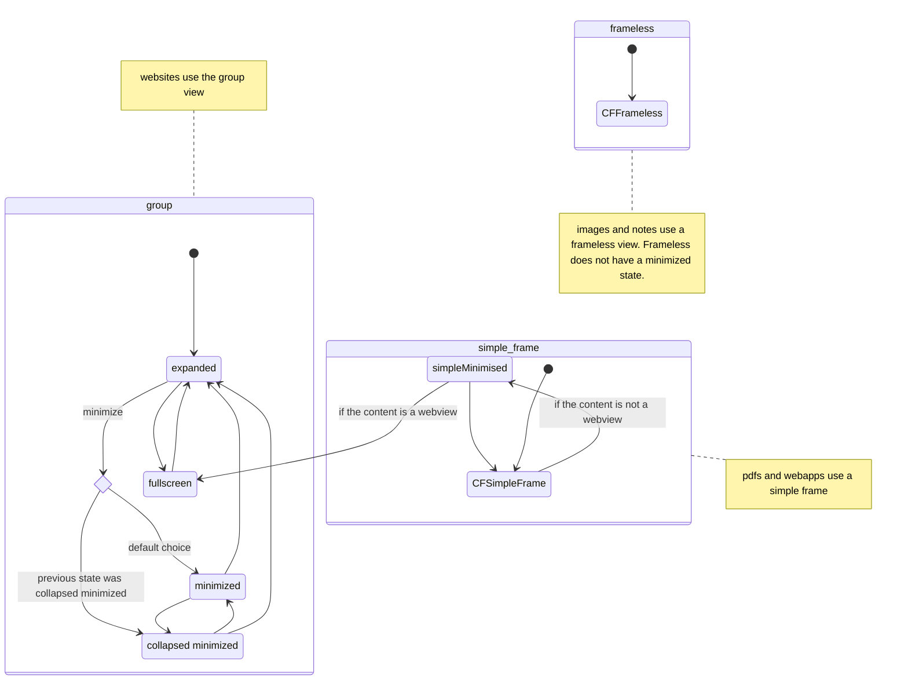

# Welcome to the ni Mac-Version

## Company wide standards:

- **ALL views are designed to 16:9 aspect ratio. As it's easier to add height then remove.**
- ALL views get designed with a default 1600px x 900px, but must scale to MBPs high resolutions
- min OS version is 14.x

---  

### What is ni?

Talk to Curran

### How does it work?

Talk to Patrick

## Important Notes

### states of the content frame controller view (`viewstate`)

The view of the content frame controller depends on the NiViewElement to be displayed in it. Here is a diagram showcasing the content and the transitions between the different view states a content frame controller can go through, split by the content types it is displaying. At the moment these are three completely split state diagrams, but it is planned that transition across will become possible and simplified.  

---  

### special UUIDs

"00000000-0000-0000-0000-000000000000" - Empty Space  
"00000000-0000-0000-0000-000000000001" - Welcome Space  
"00000000-0000-0000-0000-000000000002" - Demo Space (available only in Demo mode)  
"00000000-0000-0000-0000-000000000003" - Default User
